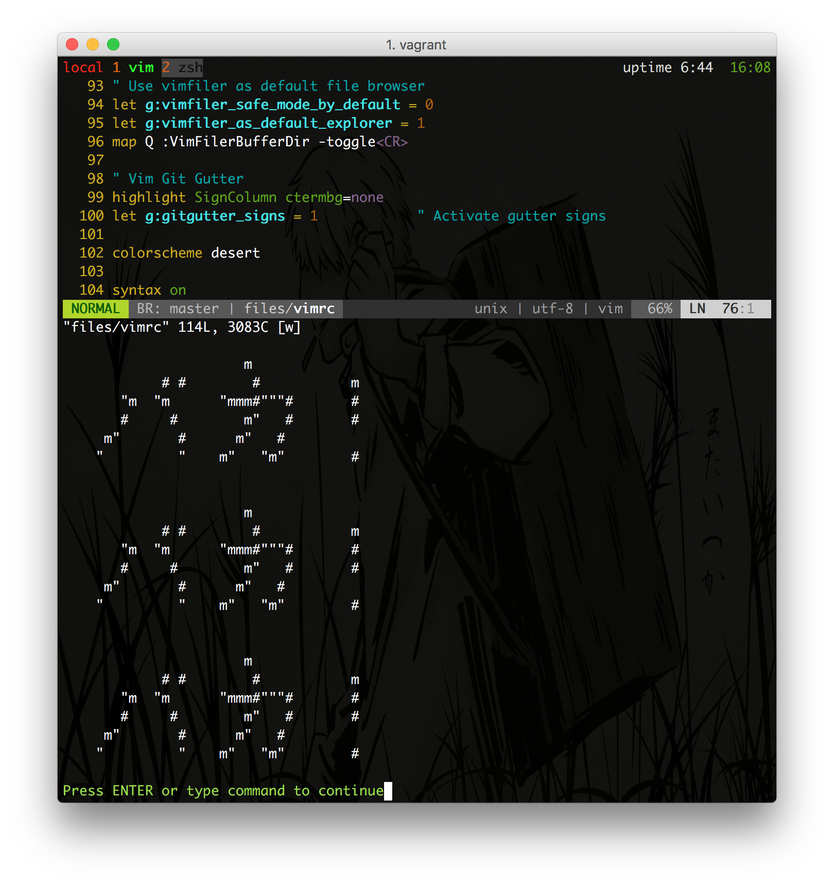

# Write protection for idiots in Vim

I created a stupid habit of saving the Vim buffer multiple times in a row.
Usually while thinking about other unrelated stuff.

To protect myself, and to fix this habit, I have created this Vim plugin that
will tell me that I am an idiot if I try to save the file multiple times in a
row.

